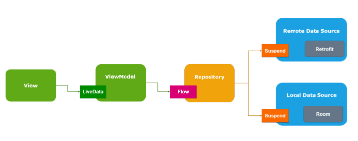

Написать приложение, которое будет:
1. Выводить списком курс доллара за последние 30 дней
2. Проверять текущий курс доллара каждый день и если он больше заданного в приложении, то выводить нотификацию.
3. Использование calendar, rxjava или корутины + flow, retrofit или ktor, di, android jetpack (compose возможен) и  architecture components приветствуется.
4. Kotlin или java не имеет значения. Чем больше технологий используется и в тему, тем лучше.
(источник данных)[http://cbr.ru/development/SXML/]
Жду исходники и видео (запись экрана в первые ~30минут от старта проекта).
Исходники рекомендуем залить на git, а видео на облако и мне отправить уже ссылки.
И просьба указать, сколько часов ушло на выполнение тестового задания.

## Архитектура надеюсь в результате будет выглядить как то так

### Документация по интересным библиотекам
(парсинг xml)[https://github.com/Tickaroo/tikxml/blob/master/docs/AnnotatingModelClasses.md]

### (Неинтересная)

## Мой путь
Дальнейший отказ от использования сторонних библиотек для сериализации xml обусловлен их устареванием или 
сложностями в использовании. Все это так же усложняет сопровождение кода в будущем
Плюс, оказывается у андроида есть под капотом хорошие инструмента для работы с xml (казалось бы, с чего это вдруг).

## Сколько было затрачено времени:
1. интерграция необходимых зависимостей 30 минут.
2. проработка архитектурных компанентов 30 минут.
3. паническая атака 2 часа, ибо я все забыл.
4. Пишем код пока пишется 8 часов.
5. Забил болт 12 часов
6. Получил пинок мотивации и снова кодить 17 часов.
7. Почитал внимательно задание и понял что делаю что то не то, но уже поздно поворачивать назад 2 минуты.
8. рефакторинг 10 минут.

### Using libraries
- retrofit
- okhttp
- hilt
- room
- live data
- MVVM
- timber
- flow
- coroutine
---
### In the feature 
- unit test
- Paging
- coil